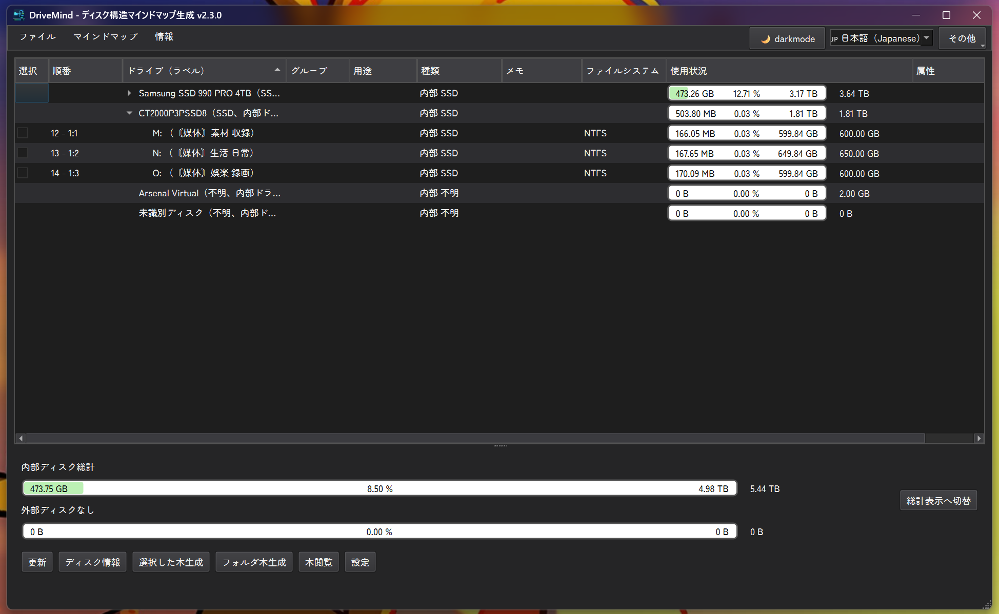
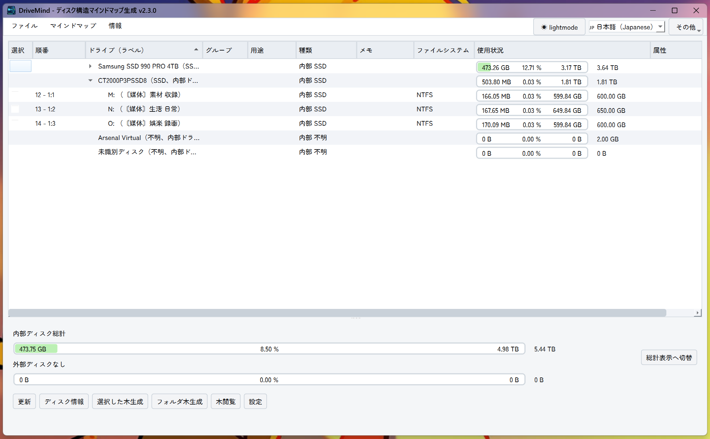
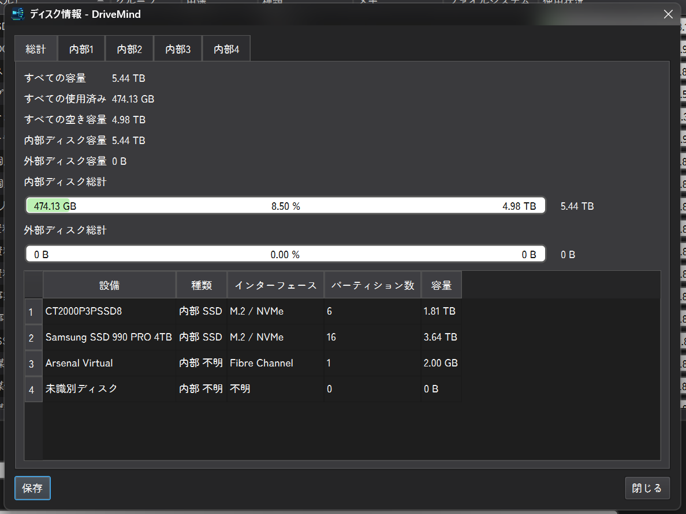
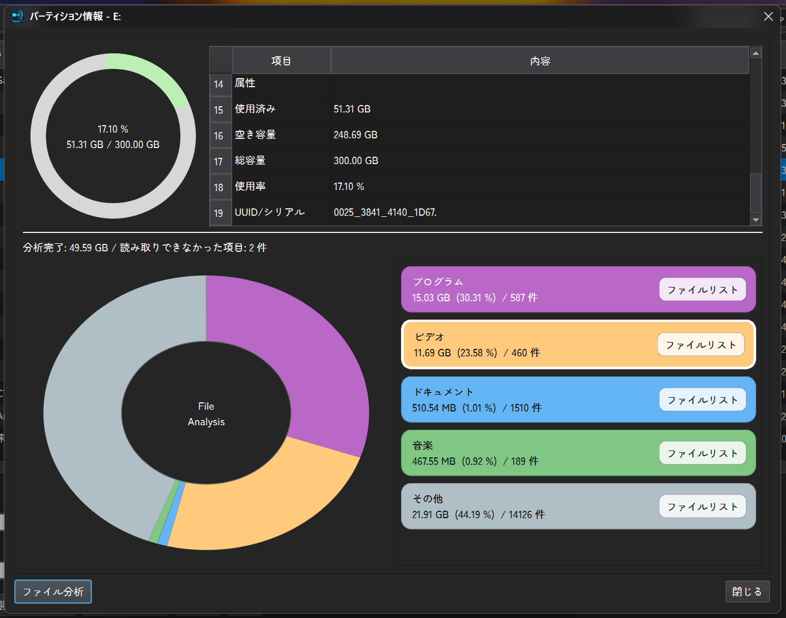
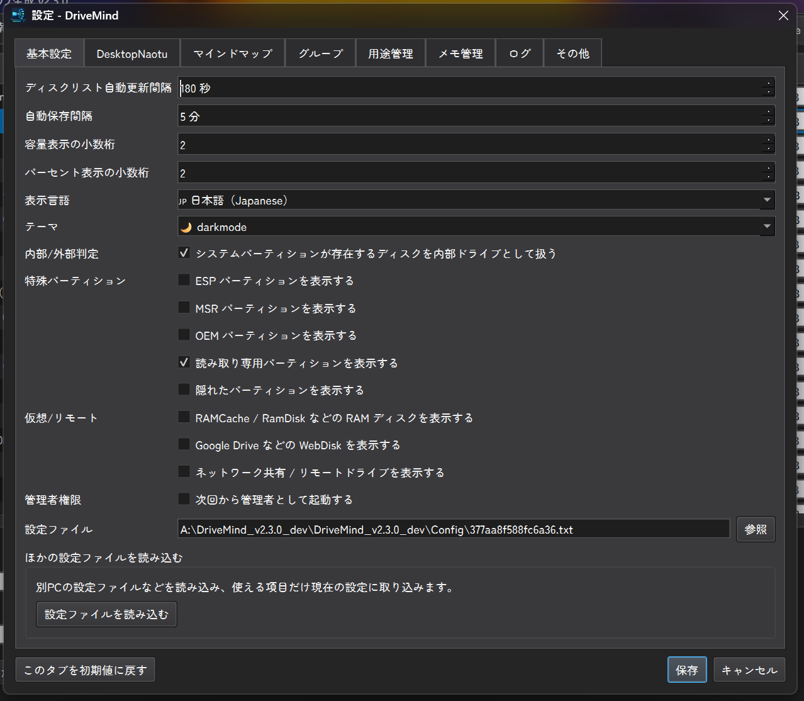
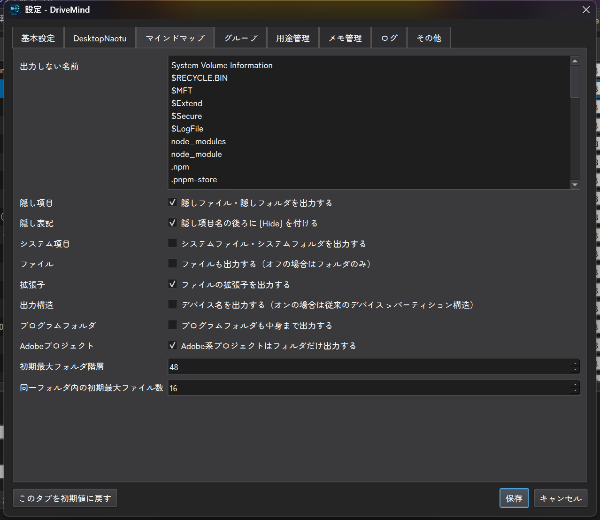
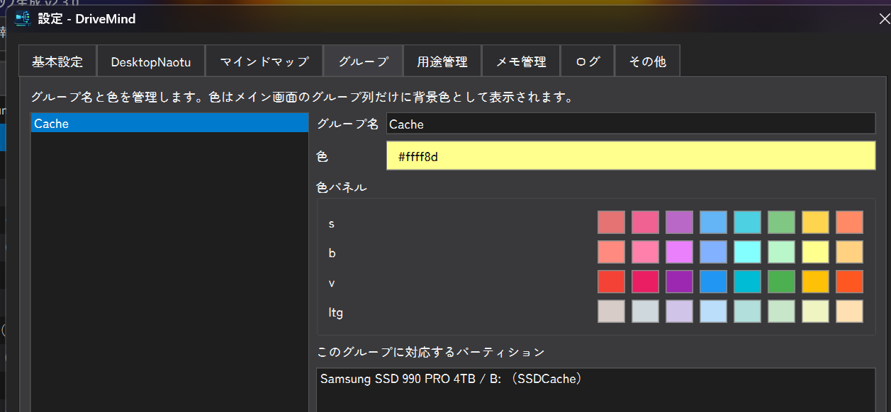

# DriveMind

[日本語](README.md) / [English](README.EN.md) / [中文](README.ZH.md) / [한국어](README.KR.md)


DriveMind 是一款 Windows 桌面程序，用于查看磁盘与分区信息，并将选中的驱动器或任意文件夹结构导出为 DesktopNaotu 可打开的 `.km` 思维导图文件。

它适合用于磁盘容量检查、外置 SSD 整理、资料盘盘点、项目文件夹可视化等场景。



## 可以做什么

- 查看内部磁盘、外部磁盘和分区列表
- 使用进度条显示已用容量、剩余容量和使用率
- 为每个分区记录组、用途和备忘
- 为组设置颜色，并显示在主界面的组列中
- 将选中的分区导出为 DesktopNaotu `.km` 思维导图
- 将任意文件夹作为根目录生成 `.km` 思维导图
- 用 DesktopNaotu 打开最近生成的地图或任意 `.km` 文件
- 查看磁盘信息、分区信息和文件分类分析
- 从分类分析结果中打开对应的文件列表
- 在日语、英语、中文、韩语之间切换 GUI 语言
- 在 darkmode 和 lightmode 之间切换主题
- 从 GitHub Releases 检查新版本
- 启动时以淡入淡出的方式显示 Brand 图片

## 启动方法

在项目文件夹中执行以下命令。

```powershell
python -m pip install -r requirements.txt
python -m pip install -e .
python -m drivemind
```

构建 Windows exe 的示例命令如下。

```powershell
pyinstaller --onefile --noconsole --name DriveMind --icon=src\drivemind\assets\logo_pure.ico --add-data "src\drivemind\assets;drivemind\assets" --paths src src\drivemind\__main__.py
```

生成的程序通常位于 `dist\DriveMind.exe`。

## 基本使用方法

### 1. 查看磁盘列表

启动 DriveMind 后，主界面会显示检测到的磁盘与分区。

每个分区会显示盘符、标签、类型、文件系统、使用情况和属性等信息。

磁盘设备本身不能被选中。可以作为 `.km` 输出对象的是带有盘符的分区。

### 2. 编辑组、用途和备忘

主界面中只有以下列可以编辑：

- 组
- 用途
- 备忘

组可以通过右键菜单或设置窗口管理。为组设置颜色后，该颜色只会显示在主列表的组列中。

### 3. 从选中的驱动器生成思维导图

1. 使用左侧复选框选择目标分区
2. 点击 `选择した木生成`
3. 确认文件夹最大层级、单个文件夹最大文件数等选项
4. 选择保存路径
5. 生成 DesktopNaotu `.km` 文件

默认最大文件夹层级为 48 层，单个文件夹内最多输出 16 个文件。子文件夹不计入文件数。

### 4. 从任意文件夹生成思维导图

点击 `フォルダ木生成` 后选择一个文件夹。

DriveMind 会把该文件夹作为根目录，只导出其中的文件夹与文件结构。

### 5. 打开生成的地图

点击 `木閲覧` 后，可以选择：

- 最近的地图
- 任意地图

只有最后生成的 `.km` 文件仍然存在时，`最近的地图` 才可用。

如果尚未设置 DesktopNaotu 路径，需要先选择 `DesktopNaotu.exe`。

DriveMind 会以以下形式启动 DesktopNaotu：

```powershell
DesktopNaotu.exe DriveMind.km
```

## 磁盘信息

点击 `ディスク情報` 可以查看所有磁盘、内部磁盘、外部磁盘的汇总信息。

可以确认容量、已用空间、剩余空间、分区数和接口信息。

## 分区信息

右键分区并选择 `パーティション情報`，可以查看该分区的详细信息。

使用率会以 Doughnut Chart 显示。文件分析会把文件分类为：

- 文档
- 音乐
- 视频
- 程序
- 其他

点击分类项旁边的 `ファイルリスト` 按钮，可以打开该分类下的文件列表。

## 设置

点击 `設定` 可以修改各种选项。

### 基本设置

- 自动刷新间隔
- 语言
- 主题
- 是否以管理员身份启动
- 是否显示 RAMDisk / WebDisk / 网络驱动器
- 是否显示 ESP / MSR / OEM / 只读 / 隐藏分区

### DesktopNaotu

- `DesktopNaotu.exe` 的路径

### 思维导图

- 文件夹最大层级
- 单个文件夹最大文件数
- 是否输出设备名
- 隐藏文件和系统文件的处理
- 是否输出扩展名
- 不输出的名称和扩展名
- 是否输出程序文件夹内部内容
- Adobe 项目是否只输出文件夹

### 组

- 添加和删除组
- 设置组颜色
- 查看属于选中组的分区列表

### 用途与备忘管理

用途和备忘按分区一对一管理。允许重复内容。

### 日志

- 日志级别
- 保留天数
- 大小限制
- 当前日志大小
- 打开日志
- 删除全部日志

### 其他

- 更新检查频率
- 重置版本提示
- 初始化全部设置

## 思维导图输出补充

默认情况下，DriveMind 会排除以下临时文件或管理文件：

- `node_modules`
- `__pycache__`
- `_` 开头的部分文件夹
- IDE 设置文件夹
- `.log` 文件
- `.tmp` 文件
- Office 临时文件
- `.DS_Store`
- `Thumbs.db`
- `desktop.ini`
- `autorun.inf`

这些选项可以在 `设置 > 思维导图` 中修改。

## 截图

### 主界面 / darkmode


### 主界面 / lightmode



### 磁盘信息



### 分区信息



### 基本设置



### 思维导图设置



### 组设置



## 作者

- 作者: [@S2OUnicus](https://github.com/S2OUnicus)
- 项目: <https://github.com/S2OUnicus/DriveMind>

## 许可证

本项目以 `CC-BY-NC-ND-4.0` 发布。

不允许商业使用，也不允许再分发修改版本。详情请查看 `LICENSE`。
