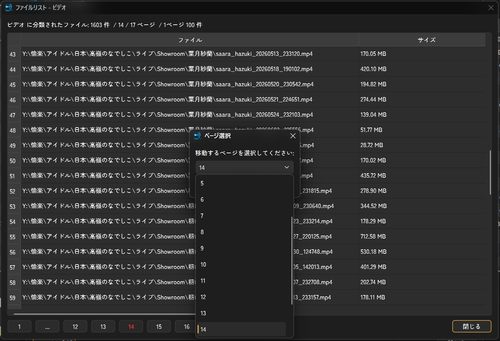

# DriveMind

[日本語](README.md) / [English](README.EN.md) / [中文](README.ZH.md) / [한국어](README.KR.md)

**DriveMind** は、Windows 向けのディスク情報表示・容量確認・フォルダ構造マインドマップ生成ツールです。  
PC に接続されている内部ディスク、外部ディスク、パーティションの状態を確認し、選択したドライブのフォルダ構造を DesktopNaotu 対応の `.km` ファイルとして出力できます。

> バージョン: `v2.0.0`  
> 作者: [@S2OUnicus](https://github.com/S2OUnicus)  
> プロジェクト: <https://github.com/S2OUnicus/DriveMind>  
> ライセンス: CC BY-NC-ND 4.0


## できること

- 接続中のディスク、パーティション、ドライブ文字、ラベルを一覧表示できます。
- 内部ディスクと外部ディスクを分けて容量総計を確認できます。
- 各ドライブの使用済み容量、使用率、空き容量、総容量を Progress Bar で確認できます。
- ドライブごとにグループ、用途、メモを設定できます。
- グループには色を設定でき、メイン画面のグループ列に反映されます。
- 選択したドライブのフォルダ構造を DesktopNaotu 用 `.km` マインドマップとして出力できます。
- 出力した `.km` ファイルを DesktopNaotu で開けます。
- パーティション情報画面で、容量、属性、使用率、ファイル種類別分析を確認できます。
- ファイル分析結果から、分類別のファイル一覧をページ表示で確認できます。
- RAM ディスク、WebDisk、ネットワークドライブ、特殊パーティションの表示/非表示を設定できます。
- GUI の表示言語を日本語、英語、中国語、韓国語から選択できます。
- darkmode / lightmode を切り替えできます。
- GitHub Releases から新しいバージョンを確認できます。

## 起動方法

開発版を起動する場合は、Python 3.10 以上を用意して、リポジトリのフォルダで以下を実行します。

```powershell
python -m pip install -r requirements.txt
python -m pip install -e .
python -m drivemind
```

Windows では以下のスクリプトからも起動できます。

```text
scripts/run_dev.bat
scripts/run_dev.ps1
```

PyInstaller で exe 化する場合の例:

```powershell
pyinstaller --onefile --noconsole --name DriveMind --icon=src\drivemind\assets\logo.ico --paths src src\drivemind\__main__.py
```

生成された実行ファイルは通常 `dist\DriveMind.exe` に出力されます。

## メイン画面の使い方

DriveMind を起動すると、上部にディスク一覧、下部に容量総計と操作ボタンが表示されます。ディスクは物理デバイスごとにまとめられ、その下にパーティションが表示されます。

```text
- Samsung SSD 990 Pro（SSD、内部ドライブ、設備: 1）
  - C: （システム）
```

一覧の主な列:

| 列 | 説明 |
|---|---|
| 選択 | マインドマップ出力対象にするパーティションを選択します。物理ディスク本体は選択できません。 |
| 順番 | 全体順と設備内順を `1 - 1:1` の形式で表示します。 |
| ドライブ（ラベル） | `C: （システム）` のように表示します。 |
| グループ | 任意の分類です。編集できます。 |
| 用途 | 例: システム、作業用、バックアップなど。編集できます。 |
| 種類 | 内部 SSD、外部 HDD などを表示します。 |
| メモ | 任意のメモです。編集できます。 |
| ファイルシステム | NTFS、exFAT などを表示します。 |
| 使用状況 | 使用済み容量、使用率、空き容量、総容量を表示します。 |
| 属性 | RO、H、OEM、NL、VSS などを表示します。 |

`グループ`、`用途`、`メモ` 以外の列は誤編集を避けるため編集できません。

列名をクリックすると、以下の列で並べ替えできます。

- 順番
- ドライブ（ラベル）
- グループ
- 種類
- 使用状況

初期表示はドライブ名の A-Z 順です。

## ディスク情報を更新する

ディスク情報は初期値では 3 分ごとに自動更新されます。すぐに更新したい場合は **更新** ボタンを押します。

読み込み中はローディング表示が出ます。ディスク取得処理はバックグラウンドで行うため、画面が固まりにくくなっています。

## ディスク情報を見る

**情報** ボタンを押すと、ディスク情報ウィンドウが開きます。総計、内部ディスク、外部ディスクごとに情報を確認できます。

確認できる主な情報:

- ディスク名
- 設備順番
- 内部 / 外部
- SSD / HDD などの種類
- インターフェース
- パーティション数
- 使用状況
- UUID などの識別情報
- S.M.A.R.T 情報

情報は TXT レポートとして保存できます。

## マインドマップを生成する

1. メイン画面で出力したいパーティションにチェックを入れます。
2. **木生成** ボタンを押します。
3. 出力前パネルで、フォルダ最大階層と同一フォルダ内の最大ファイル数を確認します。
4. 保存先を選択します。
5. DesktopNaotu 対応の `.km` ファイルが生成されます。

初期値:

| 項目 | 初期値 |
|---|---:|
| フォルダ最大階層 | 48 |
| 同一フォルダ内の最大ファイル数 | 16 |

サブフォルダは「同一フォルダ内の最大ファイル数」には含まれません。

出力される基本構造:

```text
- 属性: 設備名
  - ドライブ文字: ラベル
    - フォルダ
      - サブフォルダ
```

## マインドマップを開く

**木閲覧** ボタンを押すと、最後に生成した `.km` ファイルを DesktopNaotu で開きます。

初回利用時、または DesktopNaotu のパスが未設定の場合は、DesktopNaotu の実行ファイルを選択してください。別の `.km` ファイルを開きたい場合は、木閲覧ボタンを長押しします。

## パーティションの右クリック操作

パーティション行を右クリックすると、以下の操作ができます。

| 操作 | 内容 |
|---|---|
| パーティションを開く | エクスプローラーで対象パーティションを開きます。 |
| このパーティションの木を生成する | 右クリックしたパーティションだけを `.km` に出力します。 |
| グループ変更 | 既存グループを選択、または新規入力します。 |
| パーティション情報 | 所属デバイス、容量、属性などを表示します。 |
| 用途編集 | 用途を編集します。 |
| メモ編集 | メモを編集します。 |

## パーティション情報とファイル分析

パーティション情報画面では、対象パーティションの基本情報と使用率を確認できます。**ファイル分析** を押すと、ファイルを以下に分類して容量を集計します。

- ドキュメント
- 音楽
- ビデオ
- プログラム
- その他

分析後、右側の分類カードには容量とファイル数が表示されます。`その他` は一番下に固定され、その他以外は容量の大きい順に表示されます。各カードの **ファイルリスト** ボタン、またはカードのダブルクリックから、その分類に属するファイル一覧を開けます。

ファイルリストは 100 件ごとのページ表示です。サイズ列をクリックするとサイズ順に並べ替えできます。

## 設定

**設定** ボタンから DriveMind の動作を変更できます。

| タブ | 内容 |
|---|---|
| 基本設定 | 自動更新間隔、言語、テーマ、特殊パーティション、RAMDisk/WebDisk/リモートドライブ表示、管理者起動、設定保存先など。 |
| DesktopNaotu | DesktopNaotu の実行ファイルパス。 |
| マインドマップ | `.km` 出力時のフォルダ・ファイル名・階層制限・ファイル数制限。 |
| グループ | グループ名、色、関連パーティション。 |
| 用途管理 | パーティションごとの用途。 |
| メモ管理 | パーティションごとのメモ。 |
| その他 | 更新確認、バージョン提示リセット、設定初期化。 |

## 言語とテーマ

メインウィンドウ右上にテーマ切り替えボタンと言語リストがあります。

- テーマ: `darkmode` / `lightmode`
- 言語: 日本語、英語、中国語、韓国語

同じ設定は `設定 > 基本設定` からも変更できます。初期値は日本語と darkmode です。

## 更新確認

DriveMind は GitHub Releases を確認し、新しいバージョンがある場合に通知できます。確認間隔は `設定 > その他` で変更できます。

- 毎日確認
- 毎週確認
- 毎月確認
- 確認しない

更新通知では、Release ページを開く、今日は提示しない、このバージョンを提示しない、閉じる、を選択できます。DriveMind は自動ダウンロードや自動インストールは行いません。

## DesktopNaotu について

DriveMind は `.km` ファイルを生成しますが、DesktopNaotu 本体は同梱しません。マインドマップを開くには、DesktopNaotu を別途用意してください。

DesktopNaotu: <https://github.com/naotu/desktopnaotu>

## ライセンス

DriveMind は **CC BY-NC-ND 4.0** で公開します。

- 作者表示が必要です。
- 非営利目的で共有できます。
- 改変版の配布はできません。

英語原文は `LICENSE`、日本語説明は `LICENSE.ja`、中国語説明は `LICENSE.zh`、韓国語説明は `LICENSE.kr` を確認してください。

## 更新履歴

変更内容は `CHANGELOG.md` に記録します。

## スクリーンショット

### ディスク情報


### パーティション情報


### ファイルリスト



### グループ設定


## 作者

[@S2OUnicus](https://github.com/S2OUnicus)
